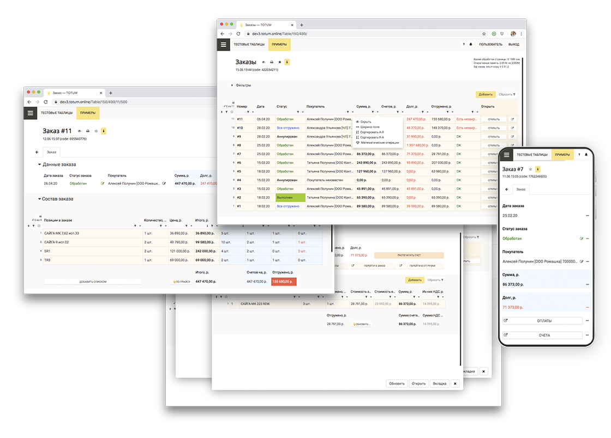

[README — RUSSIAN](/README_RU.md)

[https://mir.one](https://mir.one)

[https://docs.mir.one](https://docs.mir.one)

———

# CRM, ERP and custom constructor

**When typical solutions are not enough, for any type of data, web, open source 🎉**

**For two- or three-men teams, freelancers and business-analytics 💪 👀**

— Mir is a hybrid of electronic tables and databases.

— Ready frontend — for desktop and mobile.

— Small code principal — a lot of simple situational code.

— Learn to program Mir in about 50-60 hours.

— WEB, full-stack — install it on your own server.

— Two levels of access — programmer-user.

— Simple language —  logic, query and build-in IDE.

## Advantages

**Small code, simple language** — logic, actions, formatting and queries to data.

**Role distribution** — roles, users, hierarchy of access, access on conditions.

**Print** — print of tables, changeable templates, access to the templates of any HTML.

**Logs** — time, place, users, actions, inserted data, online status, user history, customizable log access, log of outer interactions.

**Schedule** — using of crons for completing tasks.

**Fields** — text, numbers, files, references, lists, dates, data, buttons, comments etc.

**Notifications** — text, dynamic, user-type.

**Import/export** — JSON-API, fast services, access to third-party scripts using inner code, CSV.

**Debugging** — calculations, actions, formatting, load, time of action.

**Free extension** — add your own functions, implement special interface.

## Developer

[Documentation](https://docs.mir.one/)

**Small-code principal — lot of simple situational code divided by type of use and connected to the visual structure of the program.**

**You will need from 2 to 5 less time for development.**

**You won’t need additional programs for development, optimized for Chromium and Safari.**

Build-in flexible system of access to visibility and modification of tables and fields.

Detailed tunable log of user’s actions.

Graphic interface suitable for a lot of tasks.

Development and working using one interface. Developer can immediately see user’s solutions (Easy distant maintenance).

Easy install, all api structure and transaction logic you need from the box.

You can easily transfer previous solutions into new projects. 

Integration through API.

Typical print protocols, e-mail send and using of cron.  

You don’t need to be a skilled developer to use Mir.

You don’t need to be a skilled frontend-developer (if you use standard options).

**Simple language for any level of developer.**

Build-in code highlighting, auto-insert and validation of code.

Build-in system of debugging.

You don’t need to be a skilled developer — middle-class developer can solely make big final solution.

**Easy install on server and no need in special maintenance (you can install it on typical shared).**

	CPU от 1х2.4 ГГц от 512 Мб PHP 7.3 PostgreSQL от 9.5 Apache/Nginx IonCube NIX

## Business

+ Custom CRM;

+ for warehouse planning;

+ for transactions planning;

+ work-time planning and equipment upload;

+ for Industrial planning;

+ planning systems and purchase control;

+ for logistic;

+ Interaction systems with dealers or franchisees.

## Open-source code

Open-source code on PHP.

DB PostgreSQL.

Install on your own server. ionCube is required (typical module for PHP) — encrypted part allow you to develop [commercial licenses](https://mir.one/license). All the rest code is free for modification!

You can easily interact with other programs through simple API.

**You can modify custom interface without changing the core of your solution.**

You can easily use scripts written on any other language.

## Contacts

[hi@mir.one](mailto:hi@mir.one) — just mail.

[telegram](https://t.me/mir_dev) — telegram of the project manager (@inozemtsev_roman).

[github.com/mir-one](https://github.com/mir-one) — list of repositories.

[github.com/orgs/mir-one/projects/1](https://github.com/orgs/mir-one/projects/1) — project-planning on GitHub.
